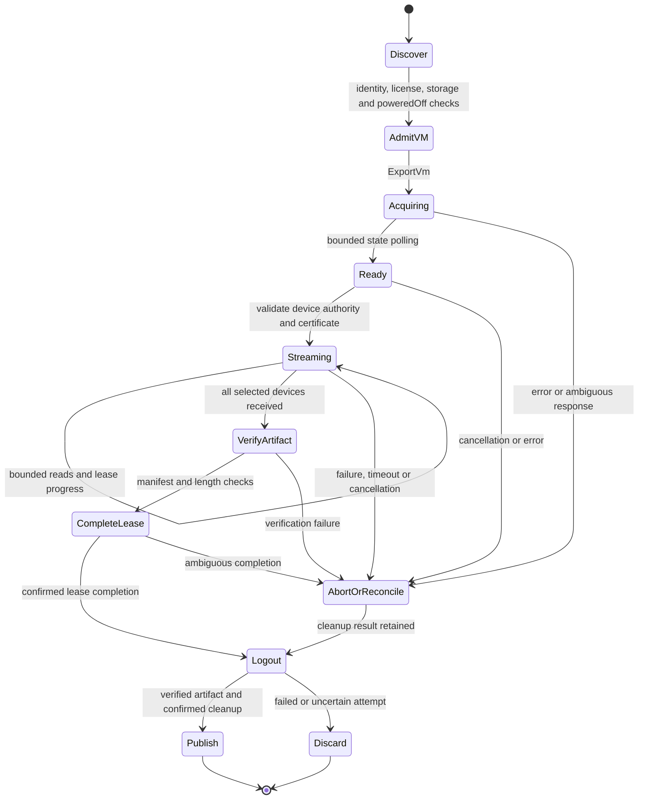

# Independent VMware access: V0.1 feasibility and lab plan

V0.1 selects **powered-off HTTP NFC export as the first candidate workflow**.
This is a sequential VMDK-container export proof. Random guest-block access,
online backup, CBT, restore and VDDK transport compatibility remain separate gates.
The local Rust data plane is unchanged. V0.2 now qualifies the independent
[Rust session/inventory crate](../crates/rvvdk-vsphere/README.md), including live
error cleanup and [matched connection-policy measurements](benchmark-results/2026-10-01-v02/README.md).
The earlier SDK-free Python probe remains V0.1 evidence. V0.3.1 now implements the
Rust lease/artifact proof and local failure fixtures. A live `ExportVm` probe returned
`license_restricted`, followed by confirmed Logout; no power change or lease was
made. [Evidence](benchmark-results/2026-10-01-v031/README.md). No live disk bytes have
been acquired. V0 remains open until licensed transfer and failure/cleanup evidence pass.

## Observed lab, 2026-10-01

**Recommended replacement lab:** ESXi 8.0 Update 3 (8.0.3), with supported active
evaluation/commercial licensing and new VMs. The user offered either version 8 or 9;
8 U3 matches the implemented 8.0.3 / HostAgent API 8.0.3.0 path and avoids adding a
version port before the first live export proof. vSphere 9 compatibility is deferred.
The observations below describe the old lab; the replacement host's certificate,
exact build, license and VM identities still require fresh qualification.

[Sanitized observations and timings](benchmark-results/2026-10-01-v01/README.md)
retain three complete inventory sessions; each logged out successfully.

| Item | Observation |
|---|---|
| Server | ESXi 8.0.3, build 24677879; HostAgent API 8.0.3.0 |
| License inventory | `esx.hypervisor.cpuPackageCoreLimited`; no expiration returned |
| License uncertainty | Deprecated `licensedEdition` empty; available-license inventory does not establish active assignment or export eligibility |
| Storage | One accessible VMFS datastore, version 6.82, about 1 TiB |
| Test VM candidates | Two Fedora guests; 30 GiB and 60 GiB disks |
| Current state | Both powered on; VMware Tools running; no snapshots reported |
| Disks | `VirtualDiskFlatVer2BackingInfo`, persistent, thick, no backing parent or encryption key reported |
| Export state | Both list ExportVm as disabled in their current state; this is not an isolated licensing test |
| Changes made | Session login/logout only; no guest power, snapshots, files, leases or licensing changed |

The host address, account/password, license keys, session cookies, VM names,
managed references and disk paths are omitted from versioned evidence. Certificate
pinning used the fingerprint observed on first contact; that is trust on first use,
not out-of-band certificate validation. The password and cookie were process-memory
only. The repository contains a parameterized probe, not a credential file.

The available-license result is consistent with the free Hypervisor installation.
Broadcom documents restricted management APIs and no VADP backup support for that
license. Therefore **successful login/inventory does not qualify export or snapshot
operations**. Do not automatically change the license or assume this installation
can later start an evaluation. Confirm exact media, entitlement and active features
when the Rust export proof is ready. [Free-license policy](https://knowledge.broadcom.com/external/article/399823/vmware-esxi-80-update-3e-now-available-a.html),
[API write restriction](https://knowledge.broadcom.com/external/article/325053/vcenter-server-installation-gets-stuck-a.html),
[LicenseManager semantics](https://developer.broadcom.com/xapis/vsphere-web-services-api/latest/vim.LicenseManager.html).

## Capability and workflow matrix

| Operation | Documented interface / prerequisites | Current evidence and decision |
|---|---|---|
| Discover and authenticate | SOAP `/sdk`, ServiceInstance, SessionManager; TLS and valid account | Passed in independent Rust (V0.2), with exact certificate pin and bounded session |
| Read inventory | PropertyCollector, object visibility/System.View | Passed in Rust for this lab account, including bounded failure/Logout; least-privilege role still unqualified |
| Discover active license | QueryAssignedLicenses when assignment manager is available; account visibility | Available-license metadata read only; active assignment/evaluation expiry still needs confirmation |
| Shut down selected guest | ShutdownGuest; VirtualMachine.Interact.PowerOff; running Tools | V0.3.2b gracefully shut down only the selected guest and observed poweredOff; no hard fallback |
| Export powered-off VM | ExportVm, VApp.Export, powered-off VM, eligible licensing | V0.3.1 license rejection retained; after the user's license update, V0.3.2c completed a manifest-verified Rust export |
| Maintain/release export | HttpNfcLease state, progress, complete/abort | Live Complete/Logout confirmed in V0.3.2c; live cancellation/deadline Abort/Logout confirmed in V0.3.2b |
| Package export | Lease device URLs, optional OVF descriptor and manifest | Treat contents as VMDK containers; no random-read guarantee |
| Online snapshot export | CreateSnapshotEx_Task + ExportSnapshot; snapshot/export/remove privileges and eligible licensing | Later phase; snapshot consistency and owned-resource cleanup need their own proof |
| Random guest-block reads / CBT | Separate transport and consistency contracts | Unproven; ordinary NBD interoperability is not VMware NBDSSL/NFC compatibility |
| vCenter-managed access | vCenter inventory/session/permissions and selected host data endpoints | Later lab; vCenter is not required for the first direct-host proof |
| Restore/import | Import lease, writes, ownership and recovery | Out of initial scope |

The [SessionManager API](https://developer.broadcom.com/xapis/vsphere-web-services-api/latest/vim.SessionManager.html)
and [PropertyCollector API](https://developer.broadcom.com/xapis/vsphere-web-services-api/latest/vmodl.query.PropertyCollector.html)
define session and one-time discovery operations. License assignment lookup is
specified by [LicenseAssignmentManager](https://developer.broadcom.com/xapis/vsphere-web-services-api/latest/vim.LicenseAssignmentManager.html).
[VirtualMachine operations](https://developer.broadcom.com/xapis/vsphere-web-services-api/latest/vim.VirtualMachine.html)
define shutdown, power-state/export requirements and privileges. A guest shutdown
request returns before shutdown finishes, so a future caller must observe poweredOff.
[Snapshot operations](https://developer.broadcom.com/xapis/vsphere-web-services-api/latest/vim.vm.Snapshot.html)
provide an export alternative for a snapshot, which is not selected for the first proof.

The [VDDK advanced transport documentation](https://developer.broadcom.com/xapis/virtual-disk-api/latest/vddkFunctions.6.11.html)
describes library APIs and transports, including NFC/NBDSSL. It does not establish
that implementing the generic NBD protocol supplies the required VMware session,
ticket, snapshot or wire semantics. **Design inference:** start with a documented
export API, while retaining independent random-block transport research as open.
No VDDK FFI, VMware SDK implementation or producer implementation is incorporated.

## Data representation is a separate gate

Broadcom describes OVF/OVA export VMDKs as compressed, stream-optimized containers.
Expect a transformation rather than a copy of the host's flat backing file, and
inspect actual headers/content types during the proof. Source backing capacity,
HTTP bytes, exported container size and decoded logical bytes are different counters.
[Export representation](https://knowledge.broadcom.com/external/article/412923/vmdk-file-in-ovfova-appear-smaller-than.html),
[export performance factors](https://knowledge.broadcom.com/external/article/389737/understanding-the-factors-that-affect-th.html).

Current rvddk supports clean version-1 hosted sparse and documented FLAT/ZERO
layouts and the bounded version-3 base streamOptimized subset. VMFS sparse and
seSparse remain unsupported.
An API backing type alone does not admit a container into that parser. Do not wire
an HTTP export stream into `BlockDevice::read_at` or treat sequential export as random I/O.

The first Rust proof may produce a verified export artifact and use an independent
reference decoder solely for lab validation. Local logical conversion now uses the bounded Rust streamOptimized decoder;
production artifact integration remains a separate R6 gate. No automatic
SDK/QEMU production fallback is authorized by this design. If disk decoding fails,
retain the bytes and diagnostics without declaring the migration successful.

## Rust implementation boundaries

V0.2 adds the `rvvdk-vsphere` control-plane crate, keeping network dependencies
out of portable `rvvdk-core`, the local format parsers and the DataMover. Start with
an internal qualification example, then define a user-facing command only after
contracts stabilize. Pinned reqwest/Rustls/roxmltree/Tokio dependencies supply
infrastructure; they are not VMware SDKs. The Python discovery probe is a
retained V0.1 qualification artifact, not a production dependency. Subsequent
VMware implementation and live qualification move to Rust; Python may continue
to generate benchmark plots.

| Component | Responsibility |
|---|---|
| `ConnectionPolicy` | Exact endpoint authority, CA or explicit fingerprint trust, bounded timeouts, no implicit redirect/proxy or cross-host credential forwarding |
| `SoapSession` | Escaped requests, typed method allowlist and bounded response parsing; secret-safe errors; cookie in memory; explicit logout result |
| `Inventory` | API-version admission, typed object references, explicit property paths, bounded pagination/object counts, stable selected VM identity |
| `ExportLease` | Own only the lease created by this invocation; typed state transitions, progress deadline, explicit complete/abort and observable cleanup errors |
| `ExportStream` | Sequential HTTPS response, fixed buffer/backpressure, incremental digest, output admission and progress; no fake seek or logical-block API |
| `ArtifactWriter` | Private files, bounded total bytes/disk-space preflight, sync, verified manifest and no-replace publication |

For the Rust foundation, target SOAP API 8.0 against the observed HostAgent 8.0.3.0;
reject unsupported server families/versions explicitly until qualified. Set proposed
initial limits of 2 MiB control responses, 128 inventory objects, bounded XML depth/
text and 16 disks per selected VM. Separate connect, inactivity and whole-operation
deadlines. Reuse authenticated HTTPS connections where appropriate; the discovery
probe's fresh TLS per request is deliberately not a production performance model.

Plan one sequential data stream with a reusable 1 MiB buffer initially. Make byte
limits and disk-space requirements explicit before acquisition, including a chosen
upper bound for unexpected stream growth. Keep metadata, XML and payload budgets
separate. Measure before introducing multiple streams, retries or async pipelines.
On an ambiguous lease acquisition, do not blindly repeat a resource-creating call.
Record uncertainty and recover the owned task/session or wait for confirmed expiry.

## Lease, TLS and cleanup design

The [lease API](https://developer.broadcom.com/xapis/vsphere-web-services-api/latest/vim.HttpNfcLease.html)
blocks conflicting VM operations while held and requires progress renewal.
Its ready-state [information](https://developer.broadcom.com/xapis/vsphere-web-services-api/latest/vim.HttpNfcLease.Info.html)
provides a timeout and device URLs. Complete only after successful transfer;
abort on cancellation/failure and confirm release. Our design keeps primary and
cleanup errors separate and refuses a success report when cleanup is uncertain.
A process crash needs explicit recovery/expiry evidence; Rust Drop alone cannot
prove remote cleanup.

[Device URL rules](https://developer.broadcom.com/xapis/vsphere-web-services-api/latest/vim.HttpNfcLease.DeviceUrl.html)
permit a wildcard host and report a TLS thumbprint. Substitute wildcard authority
only with the admitted connection host. Reject unexpected authorities, schemes
and redirects. Validate the data endpoint's certificate independently; do not
forward an API password to it. ESXi 8 proof must not depend on the newer 9.0-only
PEM-certificate field. Treat URL tickets, cookies and full URLs as credentials.

If a [lease manifest](https://developer.broadcom.com/xapis/vsphere-web-services-api/latest/vim.HttpNfcLease.ManifestEntry.html)
is available, verify its declared checksum algorithm rather than assuming SHA-256.
Always compute a local SHA-256 for provenance. Server checksums and identical
export hashes alone are not an independent logical-byte oracle; use known guest
content/reference decoding for the byte-equivalence gate.

## Disposable-lab acceptance checklist

### V0.2 — Rust session and discovery foundation

- [x] Build typed, bounded session/inventory APIs with no VMware SDK dependency.
- [x] Unit-test XML escaping/limits, SOAP faults, redacted errors, authority/pin mismatch,
  forbidden redirects, response truncation, pagination bounds and cleanup failures.
- [x] Match this lab's version, inventory, backing and power-state observations in Rust.
- [x] Confirm active license/capabilities or record explicit unresolved status.
- [x] Exercise a local mocked authentication failure; avoid repeated bad-password
  attempts against the real host. Demonstrate logout on normal and failed discovery.
- [x] Record control-plane request counts, timings and memory separately from copy benchmarks.

Completed with [V0.2 evidence](benchmark-results/2026-10-01-v02/README.md).
Active license assignment remains explicitly unresolved; available-license metadata
is not export permission. No trial or VM power change was needed.

### V0.3 — Powered-off export and cleanup proof

**V0.3.1 complete:** executable Linux export foundation, bounded fixture/failure
qualification and observed license rejection. [ADR-0048](adr/0048-bounded-export-lease-proof.md)
records the subset and limitations. V0.3.1 alone did not satisfy the live checks.
After the user's license update, V0.3.2b/c supplied the failure, complete-transfer
and independent known-byte evidence recorded in the checklist below.

- [x] Confirm operation availability after the user's license update: three exports
  now complete. No server checks were bypassed or license changes made by rvddk.
  Active-license assignment and expiry remain unresolved.
- [x] Choose the 30 GiB VM by stable private identity; recheck it immediately before
  any power operation. The 60 GiB VM was initially an untouched control; on
  2026-10-02 the user authorized using it as the LAN runner, including qemu-img
  installation and private benchmark files. User authorized source shutdown if needed.
- [x] Put known deterministic files in the selected guest or agree a reference oracle.
  Gracefully shut down through Tools, observe poweredOff, and record the final state.
  Stop on shutdown failure; do not silently escalate to a hard power cut.
- [x] Acquire one export lease, observe ready, renew within its advertised deadline,
  and download admitted disk URLs to private output with bounded buffers/bytes.
- [x] Identify the actual VMDK format and compare decoded logical bytes/known guest
  content with an independent oracle. Retain format incompatibility as a visible gate.
- [x] Test cancellation and an interrupted transfer; confirm abort/release and no
  published partial artifact. Simulate cleanup failure before provoking it remotely.
- [x] Confirm successful completion releases the lease, then publish only complete
  verified artifacts. No owned snapshots exist in this first workflow.
- [x] Report source VM state, logout, lease cleanup, input identities and independent
  validation. Preserve observations of the second VM and unchanged disk topology;
  its approved runner role changes guest files, not its disk layout.
- [x] Capture repeated transfer measurements with equal verification/sync boundaries,
  encoded versus logical byte counts, CPU, RSS, and storage/network conditions.

V0 passes for **export only** after V0.2 and V0.3 supply reproducible independent Rust
access, bytes and cleanup evidence. R6 can then integrate that workflow while
online backup/random-block access remains explicitly unproven. vCenter qualification
comes later. The historical QEMU partial second-extent producer discrepancy and
all prior performance follow-ups remain open.

### V0.3.2 — Licensed live qualification

Continue on the **existing ESXi 8.0.3 / HostAgent API 8.0.3.0 host**. The user
reported applying a license key; discovery now lists an Enterprise edition. Active
assignment remains unresolved. Subsequent V0.3.2b calls acquired leases and streamed
real disk bytes. V0.3.2c now qualifies the bounded export workflow with three
completed runs and an independent known-range oracle.
No replacement host, new VMs or vCenter is needed for the current bounded proof.
vSphere 9 remains deferred compatibility work.

The two powered-on eligibility calls returned faults but correlated with running
export tasks. The user canceled both, and read-only inspection confirmed terminal
canceled states. [V0.3.2a evidence](benchmark-results/2026-10-01-v032a/README.md)
records the failure and correction. **Never call ExportVm as a powered-on license
probe.** The executable now rejects that state locally; `--inspect` is read-only.
The existing host pin is unchanged from the earlier TOFU observation; it has not
been independently authenticated. A replacement host or certificate would require
fresh trust and identity checks, plus a new benchmark baseline.

Suggested disposable fixture: two Fedora VMs, each with one persistent, unencrypted
disk, 30 GiB on the selected VM and 60 GiB on the initial control VM. The user
subsequently approved that second VM as the V0.3.2c LAN runner. Use no
snapshots/backing parents and have VMware Tools/open-vm-tools running for graceful
shutdown. These are our proof's fixture choices, not vSphere minimum requirements.
One VM suffices for basic export, but a second permits unchanged-control checks.
Keep direct host access as the initial scope; vCenter integration remains later work.

1. Revalidate the existing host version, certificate, selected VM and second
   VM in its explicitly approved role. Record active licensing/expiry if visible; do not infer it from the
   available-edition list. Do not change license keys or retry an ambiguous acquisition.
2. Use `--inspect` to inspect recent tasks without acquiring a lease. It is bounded
   task history, not a complete lock/ownership oracle. A standalone acquire-and-abort
   probe requires poweredOff; a full export can request authorized graceful shutdown.
   Passwords remain terminal-only. Do not cancel unrelated tasks.
3. Establish an independent logical-byte oracle: deterministic guest content when
   guest access is available, or an agreed independent offline reference. Server
   manifest checksums alone do not satisfy this. Guest SSH access has been verified:
   the selected 30 GiB guest contains an 8 MiB deterministic fixture. Its XFS extent
   map, linear LVM offset and partition offset identify a logical disk range; a
   direct guest-disk read matched the local fixture before shutdown. Keep these
   private inputs outside committed evidence. The offline comparator checks those
   known bytes after independent QEMU decoding; this is not whole-source equivalence.
4. Admit a new private output and sufficient free space, gracefully shut down only
   the selected VM under the user's existing authorization, poll poweredOff, then
   run the Rust export proof. Stop on graceful-shutdown failure; no hard fallback.
5. Identify the real container and use an independent reference decoder to compare
   logical content. Retain unsupported streamOptimized/compression as a separate
   format gate; the current Rust reader must not silently accept an unsupported file.
6. Demonstrate completed and cooperatively cancelled/interrupted transfers, explicit
   lease release and Logout, no published partial artifacts, and final VM state.
   Do not disrupt host networking or unrelated sessions to inject failures.
7. Collect at least three comparable transfer runs, adding process CPU/RSS capture,
   encoded/logical counts, digest and sync boundaries, network/storage conditions and
   plots. For before/after tuning, preserve every adverse sample; any aggregate or
   individual elapsed pair above +5% triggers three longer alternating pairs.
8. Investigate V0.3.1 discovery variance with a controlled local TLS workload: its
   longer median change is +1.96%, but individual adverse matches persist. Preserve
   all recorded sessions; do not claim the individual regression gate passed.
9. Update this checklist, architecture, roadmap and implementation log; commit the
   qualified bounded step locally. V0/R6 remain open until their stated gates pass.

### V0.3.2b checkpoint and next runner decision

[Evidence and all attempt plots](benchmark-results/2026-10-01-v032b/README.md).
The selected 30 GiB guest now holds the private 8 MiB oracle and is powered off
following authorized graceful shutdown. The 60 GiB control remains powered on
and received only read-only inspection. Opaque lease references and auxiliary
files are supported within bounded disk-only scope. Real cancellation and deadline
both acknowledged Abort/Logout and removed partial staging. The one-hour attempt
received 2,544,547,134 bytes without completing; it is not a throughput benchmark.

Next, choose a runner before another long transfer. VM02 has a compatible x86_64
Linux environment and about 12.7 GiB available; qemu-img is absent. A private local
package is prepared. Using it would require installing qemu-img and copying the
frozen Rust binaries and private oracle inputs into a new private directory.
Run one artifact at a time with an explicit encoded-byte cap and free-space checks;
QEMU sparse decode can still exhaust storage, so check actual usage before repeats.
Retain reports/hashes and remove only owned duplicates after verification. This
runner shares source-host resources and must be labeled accordingly. The user was
asked to choose this role change, a separate LAN runner, or a longer timeout over
the existing connection. On 2026-10-02 the user explicitly approved VM02 as the
LAN runner, including
qemu-img installation and private files. This supersedes the untouched-control
role for the continuation. Keep it powered on, record shared-host conditions,
and retain source VM01 powered off. The initial frozen-build LAN attempt is
recorded separately from prior remote-connection failures.

At the V0.3.2b checkpoint, completed transfers, manifest verification, Complete,
independent decoded-byte comparison and three performance samples remained open.
V0.3.2c below closes those checks. The provisional
prefix identifies compressed version-3 streamOptimized, which the current native
reader does not support; do not broaden format acceptance from a partial header.

### V0.3.2c — Authorized LAN qualification and continuation

The user approved the VM02 runner on 2026-10-02. It has qemu-img 10.2.2 and the
unchanged Rust measured binaries. Source VM01 remains off. A complete export now
passes its manifest and Complete/Logout, and QEMU decodes the 30 GiB version-3
streamOptimized image. Every byte of the independently mapped 8 MiB fixture agrees.
The native reader correctly rejects version 3; no production QEMU fallback exists.
The second encoded digest differs but QEMU confirms complete decoded logical
agreement with the first. All three timed samples complete; final task inspection
shows success, all sessions
confirm Logout, and discovery confirms source off / runner on. Median encoded
throughput is 11.262 MiB/s with 231.192 seconds median whole-operation time.
[Current evidence](benchmark-results/2026-10-02-v032c/README.md).

V0 is now qualified for this export-only subset. R6 remains open. Take the
following bounded packages in order:

1. **R5.10 complete for metadata only:** separate bounded descriptor/header/footer/
   marker APIs admit QEMU front and VMware footer envelopes, including the retained
   export. That envelope API leaves maps/payloads unvalidated; public rejection persists.
   [Contract](vmdk-stream-admission.md), [evidence](benchmark-results/2026-10-02-r510/README.md).
   **R5.10p complete for scoped descriptor recovery:** the inline comparison hint
   recovers the measured small-input cost. [All controls and unresolved stream
   timing](benchmark-results/2026-10-02-r510p/README.md) remain visible. Continue
   R6.1 while retaining the controlled-runner performance follow-up.
2. **R5.11a complete — Bounded grain index:** map pointers, aliases, redundancy,
   record ordering and LBA binding pass synthetic and retained-export checks.
   [Contract](vmdk-stream-map.md), [evidence](benchmark-results/2026-10-02-r511a/README.md).
   **R5.11b complete — Bounded native grain decoding:** owned source, exact
   checksummed zlib framing, fixed scratch/cache and logical range reads pass
   complete QEMU/guest-oracle comparison. [Contract](vmdk-stream-reads.md),
   [CPU/RSS/throughput](benchmark-results/2026-10-02-r511b/README.md).
   Keep guest images private; preserve unsupported VMFS sparse/seSparse variants.
3. **R5.12 complete — Local CLI conversion qualification:** admitted subset
   integrated into inspect/plan/copy/verify, including cross-grain reads, durability
   and cancellation. [Tests and repeated plots](benchmark-results/2026-10-02-r512/README.md).
4. **R5.12p complete — Output-space qualification:** punch-first local zero output
   preserves logical semantics and reduces allocation on qualified XFS/Btrfs.
   [Repeated conversions and timing controls](benchmark-results/2026-10-02-r512p/README.md)
   retain unresolved adverse observations. R5.12q investigates the remaining
   local full-copy latency before R6.1a.
5. **R6.1 — Container export contract and ownership:** replace capacity-only
   experimental selection with explicit source identity/trust inputs. Define
   versioned artifact and durable lease-ownership records, then test process-loss
   reconciliation before claiming resumable or recoverable backup jobs. Integrate
   the proven sequential export as an artifact workflow, never as fake random I/O.
6. Keep online snapshots, multi-disk consistency, CBT, restore, vCenter and vSphere 9
   in later independently qualified steps. Keep PERF.0/R4.4 and the discovery
   variance/controlled-TLS investigation visible while adding new features.

Commit each completed bounded package with tests, evidence, performance disposition
and an updated next-session record. This sequence extends the R5/R6 roadmap; it
claims R5.10 metadata admission, R5.10p scoped descriptor recovery, R5.11a map
validation, R5.11b native reads and R5.12 CLI conversion as implemented. Overall
stream performance clearance and production integration remain open.

### Later — vSphere 9 compatibility (deferred)

The previous vSphere 9 preparation plan is retained for a later qualification.
The current executable does not admit or claim support for vSphere 9.

- Inspect the replacement host's reported product/API version and advertised SOAP
  versions without sending credentials to an unverified endpoint. Add an explicit,
  tested version policy and SOAP request version for the supported combination;
  retain rejection of unknown versions and the ESXi 8 regression fixtures. Do not
  simply remove the current version guard or assume all 9.x builds are equivalent.
- Test discovery and export lease responses for the selected version. The documented
  device URL adds optional `sslCertificate` in API 9.0.0.0; `sslThumbprint` may be
  empty. Decide and test bounded PEM/thumbprint handling under the existing exact
  SHA-256 TLS trust policy, including conflicts, malformed input and missing fields.
  The current downloader requires a matching nonempty thumbprint; do not silently
  weaken that check. Record which representation the new host actually supplies.
- Retest authentication, version rejection before Login, redaction, endpoint policy,
  manifest parsing, cancellation and complete/abort/logout. Preserve `Send` futures.
- Establish a new performance baseline on the replacement host and guests. Do not
  label comparisons with the old ESXi 8 lab as matched implementation speedups;
  software, guest content and possibly hardware/storage have changed.

References: [server/API identity](https://developer.broadcom.com/xapis/vsphere-web-services-api/latest/vim.AboutInfo.html),
[lease certificate fields](https://developer.broadcom.com/xapis/vsphere-web-services-api/latest/vim.HttpNfcLease.DeviceUrl.html),
[ExportVm contract](https://developer.broadcom.com/xapis/vsphere-web-services-api/latest/vim.VirtualMachine.html#exportVm).
These API contracts guide implementation; live vSphere 9 behavior remains unqualified.
